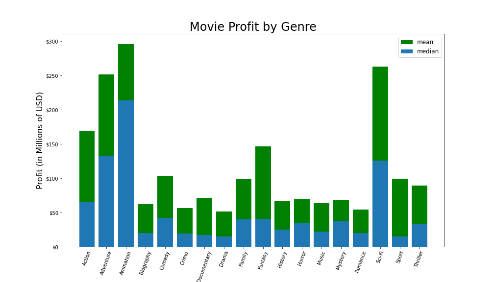
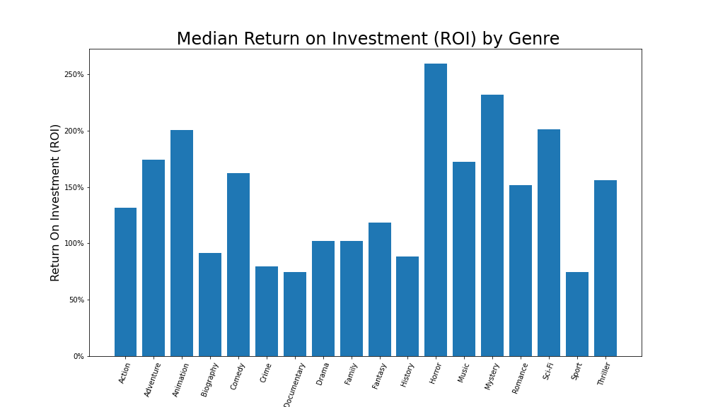
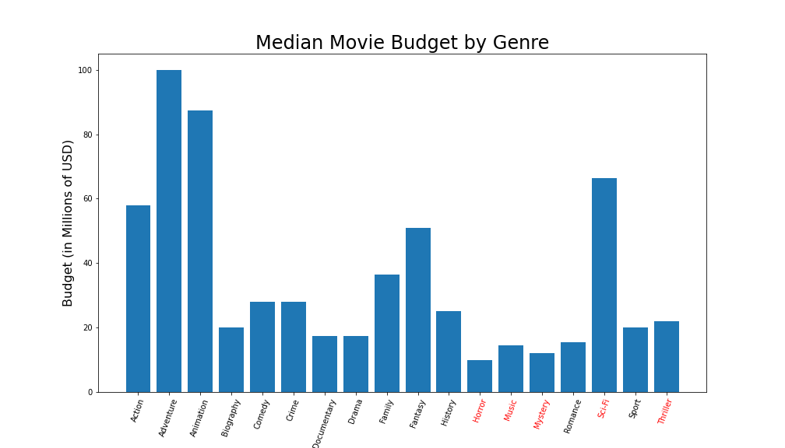
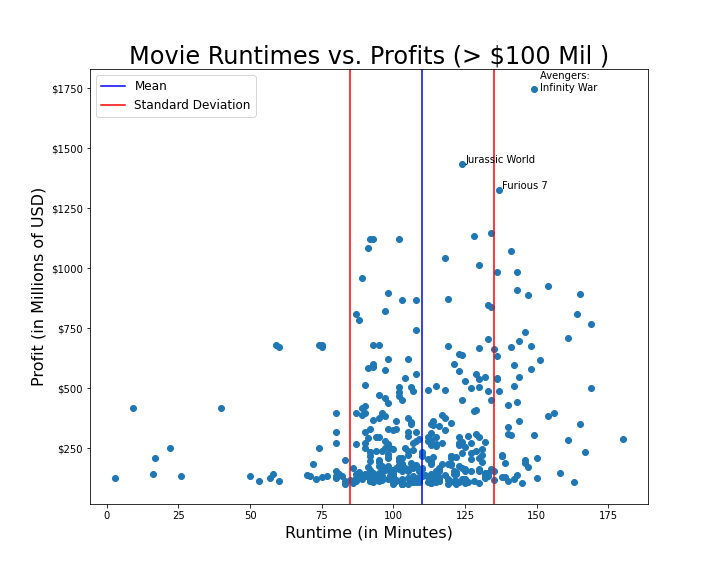
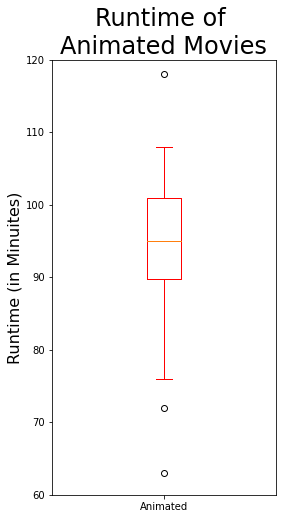
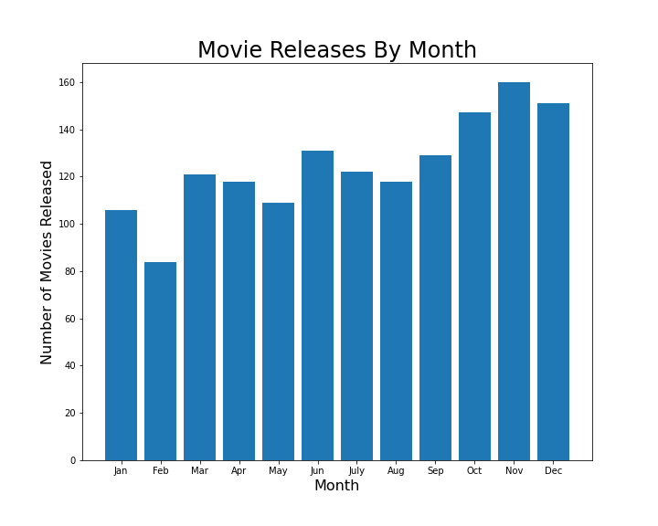
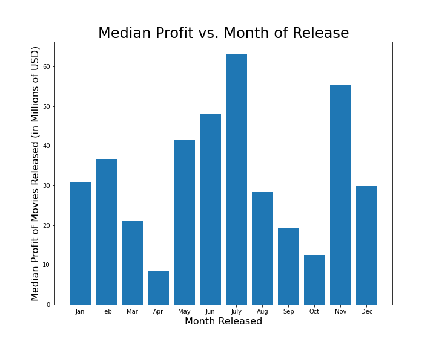

# Microsoft Movie Madness

**Author**: Joshua Allen

## Overview

Microsoft is looking to make its first foray into the movie studio business is looking for recommendations as to what it should consider as it decides what type of movie to make for its first feature length film.  We have analyzed data from a variety of industry sources ([IMDB](https://www.imdb.com), [Box Office Mojo](https://www.boxofficemojo.com/), and [The Numbers](https://www.the-numbers.com/)) by comparing genres for profitability and return on investment, runtime against profitability and how the chosen month of release for a movie can impact profitability.  In the end, it is recommended that Microsoft create an **animated movie** with a runtime of around **90-100 minutes** and a budget of approximately **87 million USD**.  The recommended months for release are the summer months of **May, June, and July.**
***

## Business Problem

Microsoft's executive team, as an newcomers to the movie studio business which is its biggest pain point with regards to this project, is attempting to determine what characteristics its movie should have.  While hitting a home run with the first movie that will return high nine-figure revenues would be great, ultimately Microsoft's goal of it's movie studio's debut film should be focused on making a movie that is profitable and manages to find the sweet spot in terms of the budget it should spend on the film.  

To help Microsoft answer those questions, we will focus on the following questions throughout our data analysis:

1. What genres of movies generate the most profit and have high returns on investment?
2. How does the runtime of a movie affect its profitability and what are the usual runtimes of the movies for the genre identified in question 1?
3. How does the chosen release date for a film affect its profitability?

By answering these three questions, we can determine a recommendation for Microsoft's movie studio as to what characteristics their first movie should contain.

***


## Data

Our data used for this project comes from two types of data sources, a couple of .csv files and an SQLite database.  These are detailed as follows:

- CSV Datasets
    - `bom.movie_gross.csv` - Dataset from [Box Office Mojo](https://www.boxofficemojo.com/) that contains relevant information on the title of the movie, domestic gross, and foreign gross for each film.
    - `tn.movie_budgets.csv` - Dataset from [The Numbers](https://www.the-numbers.com/) that contains relevant information on the title, release date, production budget, domestic gross, and worldwide gross for each film

- A table from the [IMDB](https://www.imdb.com) SQLite Database
    - `movie_basics` - Containing relevant information for our analysis on the release year, movie title, runtime, and genres.
    
There are many additional tables from the IMDB database but based upon our desire to analyze the effects of various items of profitability they were either out of scope or the time frame didn't allow for them to be analyzed.  Those are further mentioned in the accompanying notebook's Data Understanding and Further Recommendations sections.

These data sources were all joined together to be able to analyze relationships between the relevant variables indicated above.  In addition to those variables, we created two additional variables to utilize in our analysis:

- Profit
- Return on Investment (ROI)

The resulting dataframe after cleaning the existing columns and adding our two additional variables contained 1496 records across 9 columns.

### Target Variable

The target variable that Microsoft should be most concerned with is profit.  If we can focus on finding factors that result in profitable films this will give us the best chance for Microsoft to release a film that will be considered a success.
***

## Methods

### Joining and Cleaning

As mentioned above three separate dataframes obtained from relevant were joined together to produce one dataframe with the relevant data for our analysis.  Once this master dataframe was obtained, we had further cleaning to do including:

- Dropping unneeded columns
- Renaming existing columns to be more descriptive 
- Splitting strings in the genres column to produce usable lists
- Converting string type columns to integers so that they can more easily be analyzed.  
- Converting the release date to a datetime format for more functionality.  

Following the initial cleaning we then had to deal with missing data values. given that the missing data represented less than 8% of the entire dataset the decision was made to go ahead and drop those rows from the analysis.

Finally we added our additional variables of profit and return on investment (as mentioned above) and exploded our dataset around the lists column to get a separate dataframe containing each genre for a film on a separate row with all the relevant data included.  We are not concerned with these duplicated rows for movies as this dataframe will always be used in a groupedby state with the data grouped around genre so each film will only have one record in genre category.

Ultimately we wound up with two dataframes.  The general dataframe had 1,496 entries across 10 columns of data (not including  and was used primarily in questions 2 and 3 and the genre specific dataframe contained the same information as the general dataframe but was exploded by genre and contained 3,603 records.  

### Analysis

Once the necessary dataframes were created, the analysis focused around our three questions identified in our Business Problem above.

#### Q1: What Genre of Movie Should Microsoft Make?

Our genre analysis centered around exploring the effects of the genre on the median and mean profits of the film.  In this section we primarily utilized bar graphs to explore this relationship and also took a look at the Return on Investment by genre.  Finally, we explored movies budget by genre.  The results of this analysis will guide us on recommending what type of movie Microsoft should create.

#### Q2: What Runtime Should Target?

For this question we focused on successful movies (those with a greater than 100 million USD profit which represented about 1/3 of our dataset) and analyzed the 
relationship between runtime and profit using a scatter plot to review this data.  Then to further narrow the scope we analyzed the runtimes of just animated movies using a boxplot to see if they were in line with the overall successful movie scatterplot.  Based upon this analysis, we will be able to recommend how long Microsoft should target for the runtime of its first movie.

#### Q3: What Is the Best Month to Release a Movie?

For analyzing the best month for movie releases we first looked at which months were most popular for movie studios to release movies in using a bar chart to show the number of movies released each month in total in the dataset.  In addition to this, we then took a look at the profit by month in another bar chart to see if the data based on number of releases per month lined up with the median profits that were made in movies released in each month.  This analysis will help us recommend a suggested release timing to Microsoft for their new film.
***

## Results

The exploratory analysis produces results in which I am confident will allow Microsoft to begin their movie studio venture.  These results should generalize fairly well to data beyond our dataset but keep in mind that there are factors that should be considered (actor/director choices, theatrical vs. streaming release, etc.) laid out in the conclusion below.  If the further analysis is performed on those data, I believe the results below will generalize well in conjunction with the other areas for research.




From the above graphs we can see that while animated movies do not produce the highest median ROI, they do produce a fairly good median ROI of around 200% (tied for third with sci-fi).  This combined with the fact that their profits are the highest make animated movies a very good optioin.



We can see above that the median budget for an animated movie is around the 87 millioin dollar mark and likely should be the targeted bugets




Our runtimes of all highly profitable films indicate runtimes of between 85 and 135 minutes for a majority of films.  As we dig more specifically into animated runtimes we see a trend towards the lower end of that with the inter-quartile range of animated movies falling between 90 and 100 minutes.  This is likely due to animated movies being targeted in most cases towards younger audiences with shorter attention spans.




Finally as we consider the month of release for Microsoft's new movie, we can see a trend towards movies released in the summer having higher profits.  This trend seems to make sense as often families with kids out of school will see more movies during that time than when kids are in school.  In addition, the holiday months appear to also have higher median profits.
***

## Conclusions

Based upon the above anaylysis I recommend Microsoft target the following criteria for their first foray into the movie industry:

- Create an **animated movie** with around an **87 million USD budget**
- Aim for a runtime of **90 to 100 minutes** of the movie consistent with most other animated movies
- Target a **release date for May, June, or July** which will align with the summer movie season

With these analyses and answers in mind, Microsoft does need to take into consideration other variables that could aslo impact the performance of the movie.  If movie making was this simple, everyone would be involved in it.  The above analysis provides a great starting point for the Microsoft Movie Studio but the following items could still be considered to more fully solve the business problem and improve upon this work:

- Consider the effects that actors/directors have on the success of a film
- In today's environment research the difference in profitibility between streaming and theatrical releases
- Consider existing Microsoft IP to identify potential storylines and characters for the movie that already exist within the Microsoft universe and already have an pre-primed viewr base that could lead to a more successful film


## For More Information

Please review our full analysis in [our Jupyter Notebook](./Microsoft_Movie_Madness.ipynb) or our [presentation](./presentation.pdf).

For any additional questions, please contact **Josh Allen at [joshua.allen630@gmail.com](mailto:joshua.allen630@gmail.com)

## Repository Structure

Describe the structure of your repository and its contents, for example:

```
├── data                            <- Both sourced externally and generated from code
└── images                          <- Images sourced externally 
  └── visualizations                <- Images generated via code
├── .gitignore                      <- Indicates files for git to ignore during commits
├── DS_Project_Presentation.pdf     <- PDF version of project presentation
├── Microsoft_Movie_Madness.ipynb   <- Narrative documentation of analysis in Jupyter notebook
├── README.md                       <- The top-level README for reviewers of this project
```
